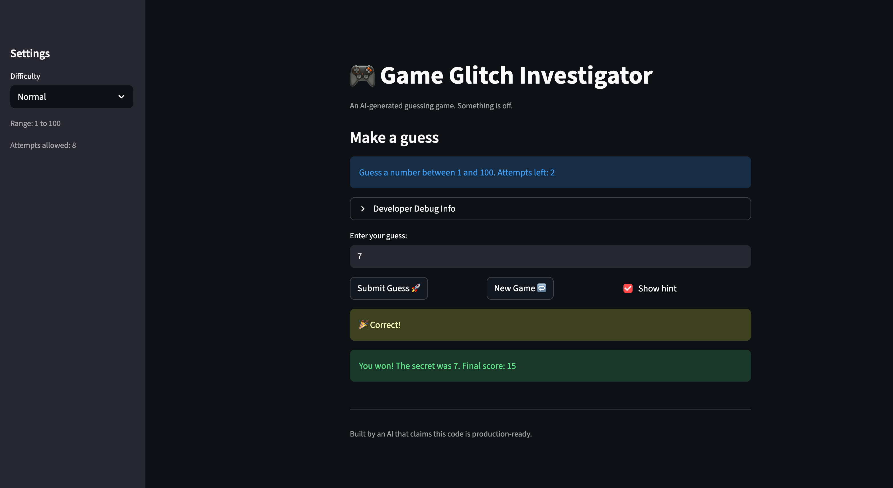

# 🎮 Game Glitch Investigator: The Impossible Guesser

## 🚨 The Situation

You asked an AI to build a simple "Number Guessing Game" using Streamlit.
It wrote the code, ran away, and now the game is unplayable. 

- You can't win.
- The hints lie to you.
- The secret number seems to have commitment issues.

## 🛠️ Setup

1. Install dependencies: `pip install -r requirements.txt`
2. Run the broken app: `python -m streamlit run app.py`

## 🕵️‍♂️ Your Mission

1. **Play the game.** Open the "Developer Debug Info" tab in the app to see the secret number. Try to win.
2. **Find the State Bug.** Why does the secret number change every time you click "Submit"? Ask ChatGPT: *"How do I keep a variable from resetting in Streamlit when I click a button?"*
3. **Fix the Logic.** The hints ("Higher/Lower") are wrong. Fix them.
4. **Refactor & Test.** - Move the logic into `logic_utils.py`.
   - Run `pytest` in your terminal.
   - Keep fixing until all tests pass!

## 📝 Document Your Experience

Describe the game's purpose:

Glitchy Guesser is a number guessing game where the player tries to guess a secret number within a limited number of attempts. The game gives hints after each guess (too high / too low) and tracks your score, rewarding faster wins.

Detail which bugs you found:

Hints were backwards — regardless of the guess, the game always told you to go higher or lower incorrectly (e.g., guessing 1 still said "Go Lower").
New Game was broken — after losing, clicking "New Game" showed the game-over message instead of resetting, because status was never reset to "playing".
Guess history stopped updating — (related to the state/rerun issues with the game being stuck in a non-playing status).
Explain what fixes you applied:

Fixed check_guess — corrected the comparison logic and the swapped hint messages so "Too High" returns "Go LOWER" and "Too Low" returns "Go HIGHER".
Fixed New Game reset — added st.session_state.status = "playing" when the New Game button is clicked so the game properly resets.
Stabilized the secret number — used if "secret" not in st.session_state to only generate a new secret once, preventing it from regenerating on every Streamlit rerun.

## 📸 Demo

## 🚀 Stretch Features

- [ ] [If you choose to complete Challenge 4, insert a screenshot of your Enhanced Game UI here]
